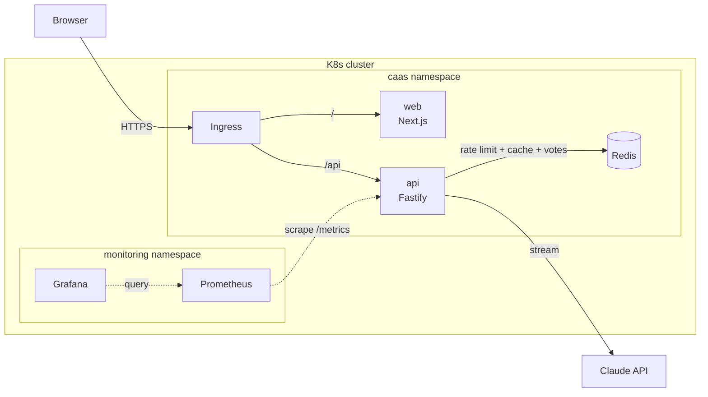

# 💔 Closure as a Service

> Endings are hard. The message doesn't have to be.

An AI-powered breakup message generator. Answer a short questionnaire about the relationship, the reason and the tone you want, and get **three distinct messages streamed in real time**, ready to copy, open in your SMS app, or tweak.

This project is also a **full-stack and cloud-native showcase**: a Next.js frontend and a Fastify streaming API that share one Zod schema, with Redis for distributed rate limiting and caching. Everything is containerized with multi-stage Docker builds and deployed to Kubernetes with probes, autoscaling and path-based Ingress routing, monitored with Prometheus and Grafana, and released from version tags.

---

## ✨ Features

- **Many kinds of endings**: a relationship, a situationship, a friendship, apologising for ghosting someone, or replying to a breakup, each with its own questions and goals
- **Multi-step wizard**: ending → duration → reason → tone → medium → optional details, validated end to end with Zod
- **Real-time AI streaming**: three variations streamed token by token from Claude (Haiku 4.5 by default, Opus 5.5 configurable)
- **Actionable result cards**: one-click copy, `sms:`/`mailto:` deep links, and quick tone-tweak regeneration
- **Refine one message**: edit it by hand or have Claude rewrite it (shorter, softer, more direct, warmer, without the reason), with undo
- **"What if they reply?"**: likely responses to the chosen message, each with a calm answer that holds the decision
- **Practice conversation**: rehearse with Claude playing the other person, with a coaching tip after each reply (up to 8 replies)
- **Read aloud**: hear a message spoken (browser speech, on-device) to rehearse an in-person conversation
- **Logistics message**: a practical follow-up about belongings, money, a shared home, pets or accounts
- **After you send it**: a short aftercare checklist, tailored to the kind of ending
- **👍/👎 feedback**: votes stored by answer category only (never text), summarised with `scripts/feedback-report.sh`
- **Safety check**: if the details suggest the user may be at risk, messages become short and final, and the page shows safety guidance and helplines
- **Privacy by default**: answers that include a name or personal details are never cached or stored; practice conversations aren't stored
- **Redis-backed rate limiting**: per-IP limits shared across every API replica
- **Result caching**: identical answers without personal text are served from Redis in milliseconds, and so are
  follow-ups (rewrites, likely replies, the opening practice reply, note-free logistics) on a message we wrote for them
- **Usage logging and metrics**: every model call logs its time to first token, total time and token counts, and the
  API exports Prometheus metrics, with a ready-made Grafana dashboard and alerts
- **Production Kubernetes setup**: Deployments, Services, ConfigMap/Secret, Ingress, HPA, PodDisruptionBudgets,
  a NetworkPolicy for Redis, hardened pods (non-root, read-only filesystem, seccomp) and persistent Redis
- **Monitoring**: Prometheus scrapes the API; Grafana shows traffic, speed, cache hit rate, failures, estimated spend
  and votes; alert rules flag outages, failures, slowness and unusual token use
- **Versioned releases**: `npm run release` tags `main`; CI publishes versioned images and a GitHub Release with a
  one-file deploy manifest

## 🏗️ Architecture



| Layer | Tech |
| --- | --- |
| Frontend | Next.js (App Router), TypeScript, Tailwind CSS v4, shadcn/ui, Motion (Framer Motion), React Hook Form |
| Backend | Node.js 22, Fastify 5, Anthropic TypeScript SDK (Claude) |
| Shared | Zod schema + inferred types (`@caas/shared`) |
| Data | Redis (rate limiting, response cache, feedback counts; AOF persistence) |
| Infra | Docker (multi-stage), docker-compose, Kubernetes (Minikube / k3d / Kind), Kustomize |
| Observability | Prometheus (`prom-client` metrics, alert rules), Grafana dashboard, structured JSON logs (pino) |
| CI/CD | GitHub Actions: lint, typecheck, tests, manifest validation, images to GHCR, tag-based releases |

## 📁 Project structure

```
.
├── apps/
│   ├── web/                    # Next.js frontend
│   │   ├── app/                # App Router: layout, pages, /healthz probe
│   │   ├── components/         # wizard, results, practice, logistics, safety notice (+ ui/ shadcn primitives)
│   │   ├── hooks/              # streaming JSON and speech hooks
│   │   ├── lib/                # API client (streaming), clipboard, utils
│   │   └── Dockerfile
│   └── api/                    # Fastify streaming API
│       ├── src/
│       │   ├── config.ts       # Zod-validated env (fail fast on boot)
│       │   ├── server.ts       # Fastify app: CORS, Redis rate limit, metrics, routes
│       │   ├── routes/         # /healthz, /readyz, /api/* (generate, follow-ups, feedback)
│       │   └── lib/            # Claude generator, prompts, streaming, cache, feedback, metrics
│       └── Dockerfile
├── packages/
│   └── shared/                 # Zod schema + TS types used by web AND api
├── k8s/                        # Kubernetes manifests (Kustomize)
│   └── monitoring/             # optional Prometheus + Grafana, dashboard and alert rules
├── scripts/
│   ├── k8s-local.sh            # local k3d cluster: up, deploy, monitoring, grafana, status, down
│   ├── release.sh              # cut a versioned release (npm run release)
│   └── feedback-report.sh      # summarise 👍/👎 votes from Redis
├── .github/workflows/ci.yml    # CI, image publishing and releases
├── docker-compose.yml          # One-command local stack
└── .env.example
```

## 🚀 Getting started

### Prerequisites

- Node.js 22+ (`nvm use`)
- Docker (for Redis locally and for container builds)
- An Anthropic API key ([console.anthropic.com](https://console.anthropic.com))

### Local development

```bash
cp .env.example .env            # then add your ANTHROPIC_API_KEY
npm install
docker run -d --name caas-redis -p 6379:6379 redis:7-alpine
npm run dev                     # web → http://localhost:3000, api → http://localhost:4000
```

The Next.js dev server proxies `/api/*` to the Fastify API, so the browser always talks to a single origin, just as it does behind the Ingress in Kubernetes.

### Tests

```bash
npm test                        # unit + HTTP tests (Vitest, Fastify inject, fake generator — no Redis or API key needed)
REDIS_TEST_URL=redis://localhost:6379 npm test   # also run the cross-replica rate-limit test
npm run lint                    # ESLint (type-aware TS rules + Next.js rules for apps/web)
npm run typecheck
npm run k8s:render              # render the Kustomize manifests
```

### Docker Compose

```bash
docker compose up --build
```

### Kubernetes

```bash
brew install k3d                # plus a Docker runtime (Docker Desktop, OrbStack, Colima)
cp .env.example .env            # add ANTHROPIC_API_KEY; it becomes the caas-secrets Secret
./scripts/k8s-local.sh up       # cluster + images + deploy  →  http://localhost:8080
```

| Command | What it does |
| --- | --- |
| `./scripts/k8s-local.sh up` | Create the k3d cluster, build the images and deploy |
| `./scripts/k8s-local.sh deploy` | Rebuild the images and roll out the changes |
| `./scripts/k8s-local.sh monitoring` | Deploy Prometheus and Grafana, then open them (see [Metrics](#-metrics)) |
| `./scripts/k8s-local.sh grafana` | Reopen Grafana (http://localhost:3001) and Prometheus (http://localhost:9090); Ctrl-C stops |
| `./scripts/k8s-local.sh status` | Show pods, services, Ingress and autoscalers |
| `./scripts/k8s-local.sh down` | Delete the cluster |

On an existing cluster, use the images CI publishes; see [`k8s/README.md`](k8s/README.md#deploy-the-published-images).

### CI

[GitHub Actions](.github/workflows/ci.yml) runs on every pull request and push to `main`: lint, typecheck, tests
(with a real Redis), validation of the app and monitoring manifests and the Prometheus alert rules, and Docker image
builds. When all of that passes on `main`, both images are pushed to
GitHub Container Registry as `ghcr.io/ayooo1/caas-{api,web}`, tagged `sha-<commit>` and `latest`.

### Releases

Cut a release from an up-to-date `main`:

```bash
npm run release              # next patch version, e.g. v0.1.0 -> v0.1.1
npm run release -- minor     # or major, or an explicit version like v0.2.0-rc.1 (a pre-release)
```

The script shows what changed since the last release, asks to confirm, then tags `main` and pushes the tag. CI runs
every check on the tag, publishes the images tagged with the version (`0.2.0`, and `0.2` for the newest patch), and
creates a [GitHub Release](https://github.com/ayooo1/closure-as-a-service/releases) with notes from the merged pull
requests and `caas-v0.2.0.yaml`, a single manifest that deploys exactly that version
(see [`k8s/README.md`](k8s/README.md#deploy-a-release)). The API reports its version at `GET /healthz`.

See [`k8s/README.md`](k8s/README.md) for Minikube / k3d / Kind specifics.

## 🔌 API

`POST /api/generate` (rate limited per client IP, shared across replicas via Redis)

```json
{ "duration": "1-3-years", "reason": "different-goals", "tone": "warm", "medium": "text",
  "name": "Sam", "details": "optional context, up to 500 chars" }
```

Valid values for each field live in [`packages/shared/src/validations.ts`](packages/shared/src/validations.ts).
The response is `text/plain`: the JSON object `{ "safetyConcern": false, "variations": [{ "angle", "message" }, …] }`,
streamed token by token. `x-cache` is `hit` (sent whole from Redis), `miss`, or `skip` (the answers include a name or
details, so they're never cached).

`ending` is optional and defaults to `relationship`; each ending accepts its own set of reasons.

Follow-ups on one chosen message (rate limited the same way). They're cached only when they hold nothing personal:
the answers have no name or details, and the message is word for word one of the cached variations (so not edited).
Practice is cached for its opening reply only, and logistics only without `notes`.

| Endpoint | Body | Streams |
| --- | --- | --- |
| `POST /api/refine` | `{ questionnaire, message, refinement }` where `refinement` is `shorter`, `softer`, `more-direct`, `warmer` or `without-reason` | `{ "message" }` |
| `POST /api/replies` | `{ questionnaire, message }` | `{ "replies": [{ "theySay", "youCanSay" }, …] }` |
| `POST /api/practice` | `{ questionnaire, message, turns: [{ role: "them" \| "you", text }] }`, alternating and ending on `you` (empty to start), at most 8 replies | `{ "theySay", "coachTip", "conversationOver" }` |
| `POST /api/logistics` | `{ questionnaire, topics: ["belongings" \| "money" \| "home" \| "pets" \| "accounts"], notes?, safetyConcern? }` | `{ "message" }` |

`POST /api/feedback` takes `{ vote: "up" | "down", ending, duration, reason, tone, medium, changed, safetyConcern }`
and returns 204. It records counts per day in Redis and never any text; see `scripts/feedback-report.sh`.

| Status | Meaning |
| --- | --- |
| 200 | Generation (streamed or cached) |
| 400 | Invalid questionnaire; `issues` lists the offending fields |
| 413 | Body too large (4 KB for `/generate`, 40 KB for `/practice`, 8 KB for other follow-ups) |
| 429 | Rate limit exceeded |
| 502 | The model provider failed before producing output |

### Choosing the model

| `AI_MODEL` | Use it for |
| --- | --- |
| `claude-haiku-4-5` (default) | Fast, low-cost generations (~1-1.5s to first token; ~2s for a rewrite, ~7s for three emails) |
| `claude-opus-5-5` | The most thoughtful writing (~2-3s to first token, ~8s total, ~4x the cost). Gets server-side refusal fallbacks automatically; set `AI_EFFORT` to tune depth |

Set it in [`k8s/configmap.yaml`](k8s/configmap.yaml) (or `.env` locally). The response cache is keyed per model, so switching never serves the other model's output.

## 🩺 Health endpoints

| Service | Endpoint | Purpose |
| --- | --- | --- |
| api | `GET /healthz` | Liveness: the process is responsive; also reports the release `version` |
| api | `GET /readyz` | Readiness: Redis is reachable |
| api | `GET /metrics` | Prometheus metrics (in-cluster only; see [Metrics](#-metrics)) |
| web | `GET /healthz` | Liveness and readiness |

## 📈 Metrics

The API serves Prometheus metrics at `GET /metrics` on each pod. It's reachable only inside the cluster: the Ingress
routes just `/api/*` to the API. Every series carries `model` and `version` labels.

| Metric | What it tells you |
| --- | --- |
| `caas_http_request_duration_seconds` | Requests, latency and status codes per API route (429 = rate limited) |
| `caas_generation_first_token_seconds` | How long users wait before text starts appearing |
| `caas_generation_duration_seconds` | Time until the whole answer has streamed |
| `caas_generations_total{result}` | Model calls: `ok`, `incomplete` (cut off, refused or invalid), `failed` (model error), `aborted` (user left) |
| `caas_tokens_total{type}` | Billed input and output tokens, for spend |
| `caas_cache_requests_total{result}` | `hit`, `miss`, or `skip` (personal, never cached) |
| `caas_feedback_votes_total{vote, ending}` | 👍 / 👎 votes |
| `nodejs_*`, `process_*` | Event loop lag, memory, CPU, GC |

Locally, `./scripts/k8s-local.sh monitoring` deploys Prometheus and Grafana ([`k8s/monitoring`](k8s/monitoring)) and
opens the **Closure as a Service** dashboard at http://localhost:3001: traffic, speed, cache hit rate, model failures,
estimated spend and helpful votes, plus memory, CPU and event loop lag per API pod. Pick a route at the top to filter,
and set the token prices there if you switch models (the defaults are Haiku 4.5's $1 / $5 per million tokens).

Anyone can view the dashboard; to edit it, sign in as `admin` with the password from
`kubectl -n monitoring get secret grafana-admin -o jsonpath='{.data.password}' | base64 -d`. Dashboard changes made in the
UI aren't saved: edit [`caas-dashboard.json`](k8s/monitoring/grafana/caas-dashboard.json) and re-run the command.

Prometheus (http://localhost:9090) keeps 15 days of data and evaluates the [alert rules](k8s/monitoring/prometheus/rules.yml):

| Alert | Fires when |
| --- | --- |
| `CaasApiDown` | No API pod has been scraped for 2 minutes |
| `CaasGenerationsFailing` | Over 20% of model calls fail for 5 minutes (bad key, quota, outage) |
| `CaasSlowFirstToken` | p95 time to first token is over 5 s for 10 minutes |
| `CaasHighTokenUse` | Over 2M tokens in an hour (~$4/hour on Haiku): look for abuse |

`./scripts/k8s-local.sh grafana` reopens both later. On a cluster with its own Prometheus, see
[`k8s/README.md`](k8s/README.md#monitoring).

## 📄 License

[MIT](LICENSE) © 2026 Ayo Osonowo
