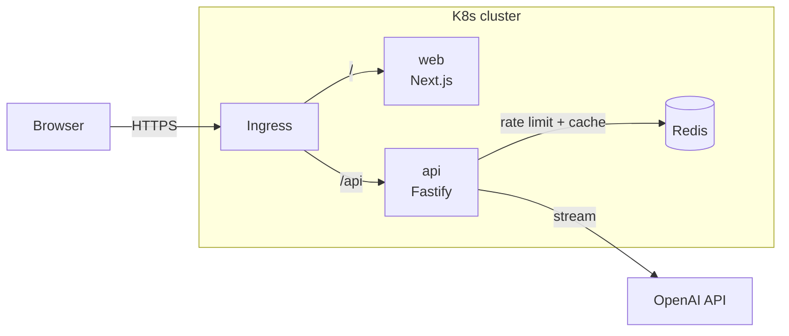

# 💔 Closure as a Service

> Endings are hard. The message doesn't have to be.

An AI-powered breakup message generator. Answer a short questionnaire about the relationship, the reason and the tone you want, and get **three distinct messages streamed in real time**, ready to copy, open in your SMS app, or tweak.

This project is also a **full-stack and cloud-native showcase**: a Next.js frontend and a Fastify streaming API that share one Zod schema, with Redis for distributed rate limiting and caching. Everything is containerized with multi-stage Docker builds and deployed to Kubernetes with probes, autoscaling and path-based Ingress routing.

---

## ✨ Features

- **Multi-step wizard**: relationship duration → reason → tone → medium → optional details, validated end to end with Zod
- **Real-time AI streaming**: three variations streamed token by token via the Vercel AI SDK and OpenAI
- **Actionable result cards**: one-click copy, `sms:` deep links, and quick tone-tweak regeneration
- **Redis-backed rate limiting**: per-IP limits shared across every API replica
- **Prompt result caching**: identical questionnaire inputs are served from Redis
- **Production Kubernetes setup**: Deployments, Services, ConfigMap/Secret, Ingress and HPA

## 🏗️ Architecture



| Layer | Tech |
| --- | --- |
| Frontend | Next.js (App Router), TypeScript, Tailwind CSS v4, shadcn/ui, Motion (Framer Motion), React Hook Form |
| Backend | Node.js 22, Fastify 5, Vercel AI SDK, OpenAI |
| Shared | Zod schema + inferred types (`@caas/shared`) |
| Data | Redis (rate limiting and response cache) |
| Infra | Docker (multi-stage), docker-compose, Kubernetes (Minikube / k3d / Kind) |

## 📁 Project structure

```
.
├── apps/
│   ├── web/                    # Next.js frontend
│   │   ├── app/                # App Router: layout, pages, /healthz probe
│   │   ├── components/ui/      # shadcn/ui primitives
│   │   ├── lib/                # utils, client helpers
│   │   └── Dockerfile
│   └── api/                    # Fastify streaming API
│       ├── src/
│       │   ├── config.ts       # Zod-validated env (fail fast on boot)
│       │   ├── server.ts       # Fastify app: CORS, Redis rate limit, routes
│       │   ├── routes/         # /healthz, /readyz, /api/generate
│       │   └── lib/            # redis client, prompt builder, cache
│       └── Dockerfile
├── packages/
│   └── shared/                 # Zod schema + TS types used by web AND api
├── k8s/                        # Kubernetes manifests
├── docker-compose.yml          # One-command local stack
└── .env.example
```

## 🚀 Getting started

### Prerequisites

- Node.js 22+ (`nvm use`)
- Docker (for Redis locally and for container builds)
- An OpenAI API key

### Local development

```bash
cp .env.example .env            # then add your OPENAI_API_KEY
npm install
docker run -d --name caas-redis -p 6379:6379 redis:7-alpine
npm run dev                     # web → http://localhost:3000, api → http://localhost:4000
```

The Next.js dev server proxies `/api/*` to the Fastify API, so the browser always talks to a single origin, just as it does behind the Ingress in Kubernetes.

### Tests

```bash
npm test                        # unit + HTTP tests (Vitest, Fastify inject — no Redis or OpenAI needed)
npm run lint                    # ESLint (type-aware TS rules + Next.js rules for apps/web)
npm run typecheck
npm run k8s:render              # render the Kustomize manifests
```

### Docker Compose

```bash
docker compose up --build
```

### Kubernetes

```bash
brew install k3d                # plus a Docker runtime (Docker Desktop, OrbStack, Colima)
cp .env.example .env            # add OPENAI_API_KEY; it becomes the caas-secrets Secret
./scripts/k8s-local.sh up       # cluster + images + deploy  →  http://localhost:8080
```

On an existing cluster, use the images CI publishes; see [`k8s/README.md`](k8s/README.md#deploy-the-published-images).

### CI

[GitHub Actions](.github/workflows/ci.yml) runs on every pull request and push to `main`: lint, typecheck, tests,
Kubernetes manifest validation and Docker image builds. When all of that passes on `main`, both images are pushed to
GitHub Container Registry as `ghcr.io/ayooo1/caas-{api,web}`, tagged `sha-<commit>` and `latest`.

See [`k8s/README.md`](k8s/README.md) for Minikube / k3d / Kind specifics.

## 🩺 Health endpoints

| Service | Endpoint | Purpose |
| --- | --- | --- |
| api | `GET /healthz` | Liveness: the process is responsive |
| api | `GET /readyz` | Readiness: Redis is reachable |
| web | `GET /healthz` | Liveness and readiness |

## 🗺️ Roadmap

- [x] Monorepo scaffold, shared package, API and web skeletons
- [ ] Zod questionnaire schema and types
- [ ] Prompt engineering and streaming `/api/generate` route
- [ ] Wizard UI and streaming result cards
- [ ] Dockerfiles and docker-compose
- [ ] Kubernetes manifests (Deployments, Services, ConfigMap, Secret, Ingress, HPA)
- [x] CI: lint, typecheck, image build and push

## 📄 License

[MIT](LICENSE) © 2026 Ayo Osonowo
